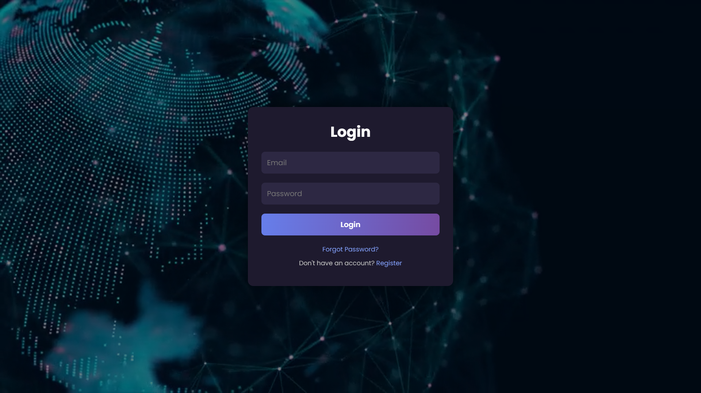

# Secure User Registration System

---

##  Project Overview

This project is a fully secure **User Registration and Authentication System** built for the CET324 Advanced CyberSecurity assignment. The system provides a robust environment for user management through a secure registration process, authentication workflow, password recovery system, session management, and role-based access controls.

The application was designed with key cybersecurity principles in mind, implementing protection mechanisms such as password hashing, OTP verification, CSRF tokens, Google reCAPTCHA, and login attempt logging with IP addresses. Users are divided into **Admin** and **User** roles, with dashboards customized for each. A dedicated admin dashboard allows viewing mock breach logs and managing user activities securely.

The primary focus is on **secure system design**, implementing **multi-layered defense**, and demonstrating a real-world simulation of cyber-hardened user authentication and management.

---

##  Technologies Used

- **PHP** – Handles all backend logic, form processing, session handling, and database interaction.
- **MySQLi** – Used for secure database operations with prepared statements to prevent SQL injection.
- **HTML5 & CSS3** – Structures and styles the user interface across all pages.
- **JavaScript** – Adds interactivity, including password strength feedback and form validation.
- **PHPMailer** – Sends OTP emails securely using SMTP.
- **Google reCAPTCHA v2** – Prevents bots from abusing forms during registration and login.
- **CSRF Tokens** – Protects sensitive forms like password reset/change from cross-site request forgery attacks.
- **Bootstrap (via CDN)** – Provides responsive design and layout structure.
- **Font Awesome & Google Fonts** – Used for icons and custom typography.
- **Chart.js** – (Optional/admin) Used to visualize data on the admin dashboard (if implemented).

---

##  Key Functionalities

1. **User Registration** – New users can register with unique emails, strong passwords, and CAPTCHA validation.
2. **Login System** – Secure login system using hashed passwords and session handling.
3. **Logout Function** – Proper session destruction and redirection.
4. **Forgot Password** – Starts password reset process using email-based OTP.
5. **OTP Verification** – Verifies emailed OTP with expiry checks before allowing reset.
6. **Password Reset** – Secure password update using OTP verification and CSRF tokens.
7. **Change Password** – Logged-in users can change their passwords after verifying the current one; prevents reuse.
8. **Password History Tracking** – Prevents reuse of the last 5 passwords using `password_history` table.
9. **Password Strength Feedback** – Real-time JS feedback to guide users while choosing a strong password.
10. **CAPTCHA Verification** – reCAPTCHA blocks bots from automated form submissions.
11. **CSRF Token System** – Token generated and verified for sensitive POST actions.
12. **Session Management** – Session start, validation, and expiration handling.
13. **Role-Based Access Control** – Session-based access for Admin/User dashboards.
14. **Admin Dashboard** – Restricted admin interface to view logs, users, and monitor activity.
15. **User Dashboard** – Secure user area with personal info and change password access.
16. **Login Attempt Logging** – Logs all login attempts, including timestamps and status.
17. **IP Address Tracking** – Captures client IP on every sensitive action for auditing.
18. **Logs Viewer (Admin)** – Admin can view breach simulation logs from JSON file.
19. **Email Sending (OTP)** – OTPs sent securely via SMTP using PHPMailer.
20. **Database Access (MySQLi)** – All DB operations use prepared statements to prevent SQL injection.

---

##  Security Measures

This system reflects industry-standard security practices. Key implementations include:

- **Password Hashing**: 
  Passwords are stored using password_hash() and verified with password_verify() during login. 
  This ensures that even if the database is compromised, plaintext passwords cannot be recovered or reused.

- **Password Strength Validation**: 
  Passwords are checked on both the frontend and backend to ensure they meet strong security criteria. 
  These include a minimum length and the presence of uppercase, lowercase, numbers, and special characters. 
  Users receive real-time feedback using JavaScript as they type.

- **Password Reuse Prevention**: 
  The system maintains a password history and prevents users from reusing any of their last five passwords. 
  This is implemented by checking the new password hash against records in the password_history table before allowing updates.

- **Google reCAPTCHA v2**: 
  To prevent automated bots from abusing the registration or login form, Google reCAPTCHA v2 is integrated. 
  It challenges the user to confirm their humanity before submitting sensitive forms.

- **OTP-Based Password Recovery**: 
  When a user forgets their password, a secure One-Time Password (OTP) is emailed to them using PHPMailer. 
  The OTP must be verified within a limited time before allowing the user to reset their password.

- **Session Management**: 
  Sessions are used to maintain user state across pages. Sensitive routes like the dashboard and admin panel are protected by checking for valid $_SESSION values. Sessions are securely destroyed on logout to prevent hijacking.

- **Role-Based Access Control**: 
  The application differentiates between Admin and regular User roles using session-stored role values. 
  Only users with the appropriate role can access admin-level pages like admin_page.php and view breach logs.

- **CSRF Protection**: 
  CSRF tokens are generated using random_bytes() and stored in the session. 
  These tokens are validated on form submission (e.g., password reset or change) to ensure requests originate from legitimate sources.

- **Login Rate Limiting**: 
  The system tracks login attempts and delays or blocks access after multiple failed attempts. 
  This helps prevent brute-force attacks and repeated login abuse.

- **IP Logging**: 
  Each login attempt and sensitive operation logs the client’s IP address using $_SERVER['REMOTE_ADDR']. 
  This supports traceability and potential attack detection.

- **Login Attempt Logging**: 
  The application logs every login attempt (successful and failed) along with time and IP. 
  These logs can be reviewed by administrators and are useful for forensics.

- **Admin Breach Logs**: 
  A simulated breach log file (mock_breach_data.json) is available to administrators. 
  This allows them to monitor activity as if responding to real-world incidents, aiding in security awareness.

- **Email Uniqueness Check**: 
  Before creating a new account or sending an OTP, the system checks if the email already exists in the database. 
  This prevents duplicate accounts and OTP spam.

- **Prepared SQL Statements**: 
  All database queries use prepare() and bind_param() to securely inject values. This eliminates the risk of SQL injection attacks.

- **PHPMailer via SMTP**: 
  Emails are sent using PHPMailer configured with secure SMTP. This ensures that OTP messages are sent reliably and securely, 
  reducing the risk of spoofing or delivery failure.

- **Real-time Feedback**: 
  When users type a password during registration or reset, the interface provides visual feedback (e.g., Weak, Medium, Strong). 
  This helps guide users toward choosing a secure password.

- **Logout Handling**: 
  On logout, the session is completely destroyed and the user is redirected. This ensures that no residual session data remains accessible on the device or browser.

- **Token Expiry**: 
  OTP and CSRF tokens are managed with expiration logic. If the user waits too long to verify the OTP or resubmit the form, the token becomes invalid, protecting against replay attacks.


---

##  Project Structure

| File / Folder           | Purpose |
|-------------------------|---------|
| `index.php`             | Login interface |
| `register.php`          | User registration form |
| `user_page.php`         | User dashboard |
| `admin_page.php`        | Admin dashboard |
| `change_password.php`   | Allows users to change their password |
| `forgotpassword.php`    | Starts the password reset process |
| `send_OTP.php`          | Sends OTP email |
| `verify_OTP.php`        | Verifies OTP |
| `reset_password.php`    | Allows setting a new password |
| `logout.php`            | Logs the user out securely |
| `logs.php`              | Displays mock breach logs |
| `mock_breach_data.json` | Static file for simulated attacks |
| `script.js`             | Password strength checker and interactivity |
| `style.css`             | Visual styling and layout |
| `config.php`            | Database connection and session configuration |
| `Website_Project.php`   | Core logic handling (login, registration) |

---

##  CAPTCHA & Password Logic

- **CAPTCHA (Google reCAPTCHA v2)**: 
  Implemented on the registration forms to block bots. The g-recaptcha-response is validated server-side using Google’s API to ensure the request is made by a human user.

- **Password Strength**:
  - Passwords must include at least 8 characters, one uppercase letter, one lowercase letter, one number, and one special character. 
  - Validation is done both client-side (JavaScript) with real-time feedback, and server-side (PHP) using regex to enforce complexity even if client-side validation is bypassed.

---

##  Setup Instructions

1. **Place the project in your server root**  
   - Example (for XAMPP): `C:/xampp/htdocs/Website_Project`

2. **Create the MySQL database**  
   - Name it: `user_db`  
   - Use phpMyAdmin or MySQL CLI

3. **Manually create or import the following tables**:

   - **`user`**  
     - Columns: `Id`, `Name`, `Email`, `password`, `Role`, `last_seen`

   - **`password_history`**  
     - Columns: `Id`, `user_id`, `password_hash`, `changed_at`

   - **`logs`**  
     - Columns: `Id`, `user_email`, `event_type`, `event_time`, `details`

4. **Edit `config.php`** to use your DB:
   ```php
    $host = "localhost";
    $user = "root";
    $pass = "";
    $db   = "user_db";
   ```

5. **Configure `send_OTP.php`** with your email SMTP:
   ```php
    $mail->Host = 'smtp.gmail.com';
    $mail->Username = 'your_email@gmail.com';
    $mail->Password = 'your_app_password';
   ```

6. **Run the system in your browser**  
   - Go to: `http://localhost/Website_Project/index.php`

---

##  Limitations & Future Improvements

- No HTTPS header enforcement (CSP, X-Frame-Options not set)
- No 2FA on login (OTP is only for reset)
- No database migration or seed scripts
- Audit trail could be enhanced for better admin control

---

##  Screenshots

Here are some key views of the application:

###  Login Page


###  Registration Page


###  User Dashboard


###  Admin Dashboard


###  Logs View (Admin)


###  Forgot Password + OTP


### Change Password


---

##  License

© 2025 Aashish Puri  
All rights reserved.  
This project is for academic purposes only and not licensed for public distribution.